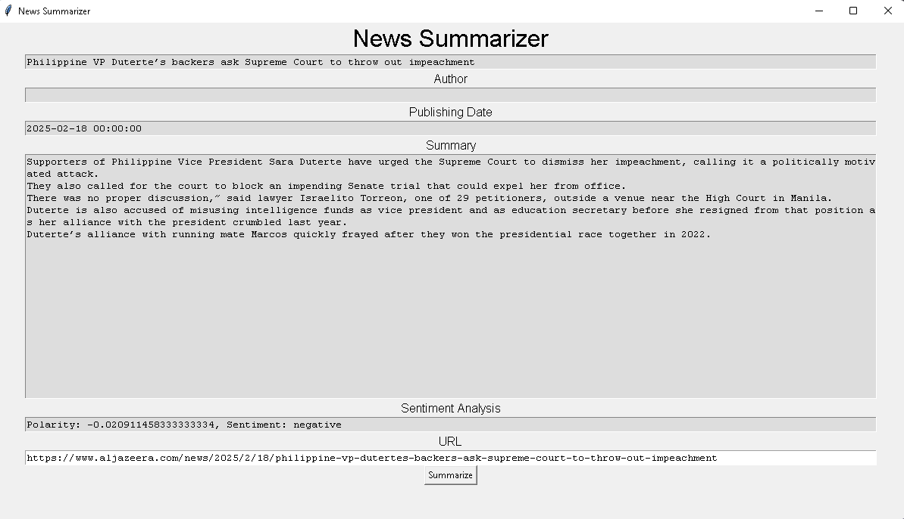

# 📰 News Summarizer

**A Python-based GUI application that fetches and summarizes news articles from a URL using Natural Language Processing (NLP) techniques.**



## 📌 Project Overview

The News Summarizer is a desktop application designed to streamline the process of reading news articles. By entering a URL, users can quickly obtain:

- **Article Title**
- **Author(s)**
- **Publication Date**
- **Concise Summary**
- **Sentiment Analysis**

This tool leverages NLP libraries to extract and process information, providing users with a quick and insightful overview of news content.

## ⚙️ Features

- **User-Friendly Interface:** Built with Tkinter for a simple and intuitive GUI.
- **Content Extraction:** Utilizes `newspaper3k` to fetch and parse article content.
- **Text Summarization:** Employs `TextBlob` to generate concise summaries.
- **Sentiment Analysis:** Analyzes the sentiment of the article to indicate positive, negative, or neutral tones.
- **Metadata Display:** Shows the article's title, author(s), and publication date for context.

## 🛠️ Installation

1. **Clone the Repository:**

   ```bash
   git clone https://github.com/frediking/NEWS-SUMMARIZER.git
   cd NEWS-SUMMARIZER
   ```

2. **Create a Virtual Environment (Optional but Recommended):**

   ```bash
   python -m venv venv
   source venv/bin/activate  # On Windows: venv\Scripts\activate
   ```

3. **Install Dependencies:**

   ```bash
   pip install -r requirements.txt
   ```

   *Note: Ensure that `newspaper3k`, `TextBlob`, and `nltk` are included in your `requirements.txt`.*

4. **Download NLTK Data (If Not Already Installed):**

   ```python
   import nltk
   nltk.download('punkt')
   ```

## 🚀 Usage

1. **Run the Application:**

   ```bash
   python tk.py
   ```

2. **Using the GUI:**

   - Enter the URL of a news article.
   - Click the "Summarize" button.
   - View the extracted information and summary in the provided fields.

## 🧪 Example

*Coming Soon:* A demonstration video or GIF showcasing the application's functionality.

## 📂 Project Structure

```
NEWS-SUMMARIZER/
├── tk.py                  # Main application script with GUI logic
├── requirements.txt       # List of required Python packages
├── news-summarizerSS.png  # Screenshot of the application
└── README.md              # Project documentation
```

## 📄 License

This project is licensed under the [MIT License](LICENSE).

## 🤝 Contributing

Contributions are welcome! Please fork the repository and submit a pull request for any enhancements or bug fixes.

---

*For any questions or feedback, feel free to open an issue or contact the repository owner.*
